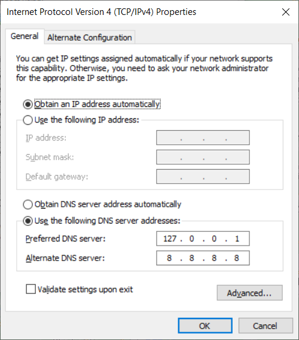
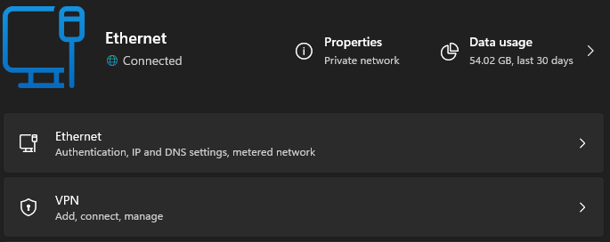
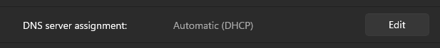
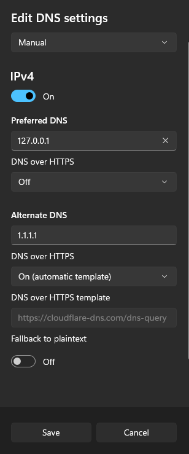
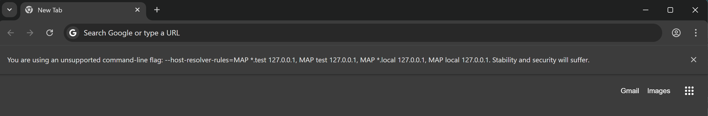

# Automatic DNS Resolution

In order to allow automatic DNS resolution using the provided dnsmasq service we will need to make sure DNS request are routed through our local network.
This requires some configuration.

## Configuration per network

### Mac

On Mac OS, DNS resolution is configured automatically for `*.test` domains using a feature Mac OS inherits from BSD. When `warden install` is run (or `warden svc up` for the first time) the following contents are placed in the `/etc/resolver/test` file. This has the effect of having zero impact on DNS queries except for those under the `.test` TLD.

```
nameserver 127.0.0.1
```

If you desire to have more than this route through the `dnsmasq` container, you could place another similar file in the `/etc/resolver/` directory on a per-TLD basis, or alternatively configure all DNS lookups to pass through the `dnsmasq` container. To do this, open up Advanced connection settings for the WiFi/LAN settings in System Preferences, and go to the DNS tab. In here press the "+" button to add a new DNS record with the following IP address: `127.0.0.1` followed by fallback records:

```text
127.0.0.1
1.1.1.1
1.0.0.1
```

### systemd-resolved

This approach works on most modern (systemd based) operating systems.

`systemd-resolved` can be configured to forward the requests of `.test` TLD to another DNS server. The configuration file is typically located at `/etc/systemd/resolved.conf` and `/etc/systemd/resolved.conf.d/*.conf`. Run the following commands to configure systemd-resolved:

    sudo mkdir -p /etc/systemd/resolved.conf.d
    echo -e "[Resolve]\nDNS=127.0.0.1\nDomains=~test\n" \
      | sudo tee /etc/systemd/resolved.conf.d/warden.conf > /dev/null
    sudo systemctl restart systemd-resolved

### Ubuntu resolvconf

Use the `resolvconf` service to add a permanent entry in your `/etc/resolv.conf` file.

Install resolvconf

```bash
sudo apt update && sudo apt install resolvconf
```

Edit the `/etc/resolvconf/resolv.conf.d/base` file as follows:

```text
search home net
nameserver 127.0.0.1
nameserver 1.1.1.1
nameserver 1.0.0.1
```

Restart network-manager

```bash
sudo service network-manager restart
```

:::{note}
In the above examples you can replace ``1.1.1.1`` and ``1.0.0.1`` (CloudFlare) with the IP of your own preferred DNS resolution service such as ``8.8.8.8`` and ``8.8.4.4`` (Google) or ``9.9.9.9`` and ``149.112.112.112`` (Quad9)
:::

### Windows

Add the local dnsmasq resolver as the first DNS server:

#### Windows 10


#### Windows 11
Open the Network & Internet control panel


Edit `DNS server assignment` and switch it to `Manual`


For IPv4, set `Preferred DNS` to `127.0.0.1`


:::{warning}
On some newer Windows 11 systems using WSL2 and Docker Desktop, host-side networking components such as the Hyper-V firewall and `SharedAccess` (`svchost.exe`) may still prevent Windows DNS requests from reaching Warden's local `dnsmasq` service even after `127.0.0.1` is configured as the primary DNS server. In that situation, Warden DNS may work correctly inside WSL while Windows applications still fail to resolve the same domains. When that happens, Windows DNS over HTTPS can be a particularly useful workaround because it avoids relying on plain local DNS traffic to `127.0.0.1`.
:::

:::{important}
If plain Windows DNS still does not resolve your Warden domains, try these options in order.
:::

(windows-doh)=
#### 1. Enable Windows DNS over HTTPS for Warden

This is the preferred workaround because it is system-wide, works better with Windows-native networking once the Warden root CA is trusted, and may succeed on systems where plain `127.0.0.1` DNS is disrupted by Hyper-V, `SharedAccess`, or similar Windows networking behavior.

   First enable Warden's optional DoH bridge in `~/.warden/.env`:

   ```text
   WARDEN_DNS_OVER_HTTPS_ENABLE=1
   ```

   When this option is enabled, Warden will also keep its global `dnsmasq` service enabled because the DoH endpoint forwards queries to the existing local resolver.

   Then restart global services:

   ```bash
   warden svc up
   ```

   Warden will expose the DoH endpoint through Traefik at `https://doh.warden.test/dns-query` by default.

   Before Windows can use that URL, make sure the DoH hostname resolves locally. From an elevated PowerShell prompt, add it to the Windows `hosts` file:

   ```powershell
   $hostsPath = "$env:SystemRoot\System32\drivers\etc\hosts"
   $entry = "127.0.0.1 doh.warden.test"
   if (-not (Select-String -Path $hostsPath -SimpleMatch $entry -Quiet -ErrorAction SilentlyContinue)) {
       Add-Content -Path $hostsPath -Value $entry
   }
   ```

   Warden can register the DoH template for `127.0.0.1` automatically when it is installed from WSL with the Windows bridge available.
   If you want to confirm the template is present, you can verify it with:

   ```powershell
   Get-DnsClientDohServerAddress -ServerAddress 127.0.0.1
   ```

   Then configure your network adapter to actually use `127.0.0.1` as DNS.

   Windows 11 UI

   Go to `Settings -> Network & Internet -> [Adapter, for example WiFi or Ethernet] -> Hardware properties`. This should look similar to the following:

   ```{image} screenshots/dns-resolver--win11-doh-settings.png
   :alt: Windows 11 DNS over HTTPS manual template configuration
   :width: 400px
   ```

   The resulting Windows 11 configuration should be:

   * `Preferred DNS`: `127.0.0.1`
   * `DNS over HTTPS`: `On (manual template)`
   * `DNS over HTTPS template`: `https://doh.warden.test/dns-query`
   * `Alternate DNS`: your normal resolver such as `1.1.1.1`

   Save the setting. Once it is applied, `*.test` domains should resolve automatically through Warden.

   :::{note}
   Keep Warden in `Preferred DNS` and your normal resolver in `Alternate DNS`.
   If `Alternate DNS` is empty, internet DNS may stop working when Warden is stopped.
   DoH template registration alone does not set these adapter DNS values for you.
   :::


(windows-chrome-host-resolver)=
#### 2. Launch Chrome with host resolver overrides

This is often sufficient for browser use because it applies a wildcard mapping without requiring one `hosts` entry per hostname:

```text
"C:\Program Files\Google\Chrome\Application\chrome.exe" --host-resolver-rules="MAP *.test 127.0.0.1"
```

Chromium documents <a href="https://chromium.googlesource.com/chromium/src/+/main/net/dns/README.md" target="_blank" rel="noopener noreferrer"><code>--host-resolver-rules</code> &#8599;</a> as a request remapping flag that can map hostnames to another hostname, an IP address, or `NOTFOUND`. Chrome will show a warning about the unsupported command-line flag, but the `.test` wildcard resolution itself will still work for that browser session.



(windows-hosts-fallback)=
#### 3. Add the required domains to the Windows `hosts` file

This is the most manual option, but it always works if you only need a small set of fixed hostnames.

These workarounds are relatively safe because they do not require changing Windows, WSL, or Hyper-V default networking behavior. The Chrome workaround only affects that browser process and does not fix DNS for Windows generally. Other Windows applications and browsers will still need working DNS resolution or matching `hosts` file entries. For more background on WSL networking and Hyper-V firewall behavior, see Microsoft's [WSL networking documentation](https://learn.microsoft.com/en-us/windows/wsl/networking).
