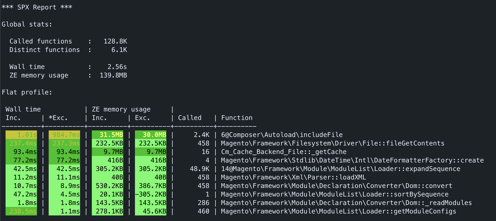
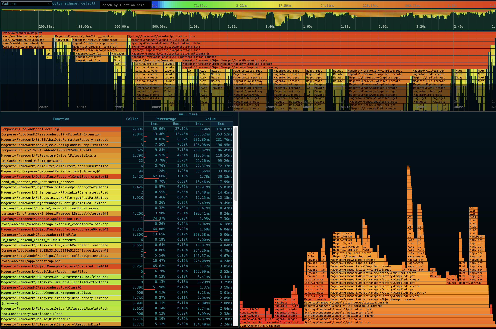
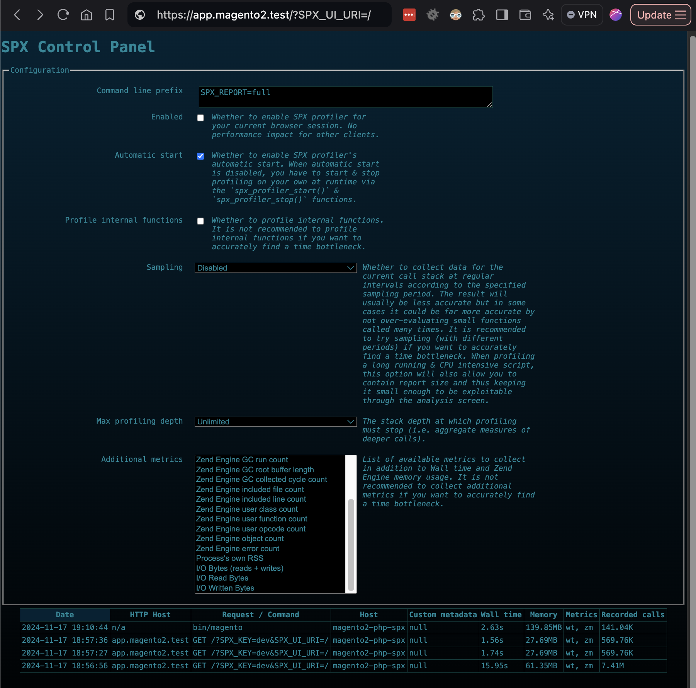

# PHP SPX Profiling

PHP SPX is a simple, free and open source profiler. It covers both FPM and CLI requests, and provides a built-in UI to visualise the generated reports. Of which a [demo can be seen here](https://noisebynorthwest.github.io/php-spx/demo/report.html?key=spx-full-20191229_175636-06d2fe5ee423-3795-233665123).

For more information, please see the [PHP SPX Github Repository](https://github.com/NoiseByNorthwest/php-spx).


## Configuration


To enable PHP SPX in your project environment, add to your `.env` file:
```
WARDEN_PHP_SPX=1
```

:::{note}
When disabling SPX, you may be presented with a 502 bad gateway when the environment is next restarted, or the SPX container is removed.

This is caused due to the SPX cookies still being set in your browser. There is a helper tool to aid in removing these on the 502 page, or you can remove them manually through developer tools.
:::


## Usage

### CLI

Running the `warden spx` command, will place you within a PHP-SPX instrumented terminal. Where any PHP commands you run will be profiled.

You should see a SPX report printed after the command finishes. And there will also be a corresponding report within the control panel.




### Web

Once an environment is started with the `WARDEN_PHP_SPX=1` flag set, all web requests will be profiled. To override this, you can uncheck the `Automatic start` option within the control panel. 



### Control Panel / Viewer

To view the reports generated by PHP SPX, append `?SPX_UI_URI=/&SPX_KEY=warden` to the end of your environment url (e.g `https://app.magento2.test/?SPX_UI_URI=/&SPX_KEY=warden`). 


