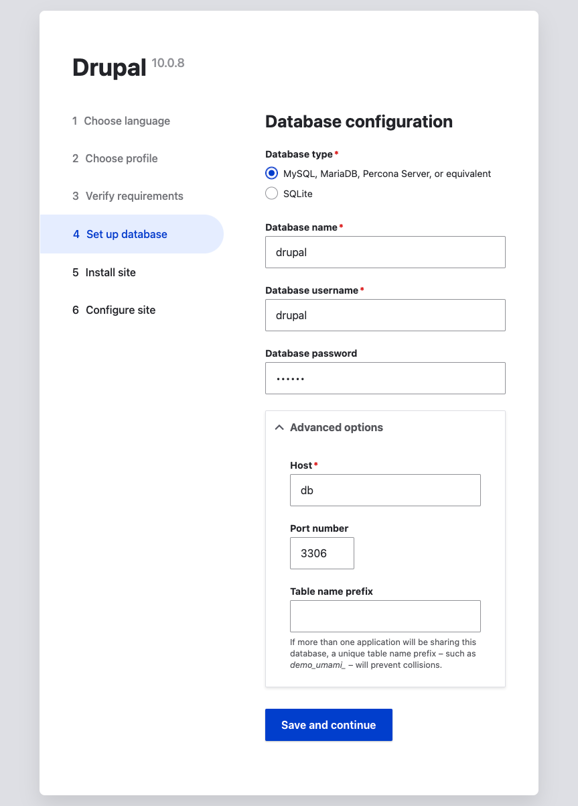

# Installing Drupal

The below example demonstrates the from-scratch setup of a Drupal application for local development. A similar process can easily be used to configure an environment of any other type. This assumes that Warden has been previously started via `warden svc up` as part of the installation procedure.

1.  Create a new directory on your host machine at the location of your choice and then jump into the new directory to get started:

        mkdir -p ~/Sites/exampleproject
        cd ~/Sites/exampleproject

2.  From the root of your new project directory, run `env-init` to create the `.env` file with configuration needed for Warden and Docker to work with the project.

        warden env-init exampleproject drupal

    The result of this command is a `.env` file in the project root (tip: commit this to your VCS to share the configuration with other team members) having the following contents:

        WARDEN_ENV_NAME=exampleproject
        WARDEN_ENV_TYPE=drupal

        WARDEN_WEB_ROOT=/

        TRAEFIK_DOMAIN=tdpl.test
        TRAEFIK_SUBDOMAIN=app
        DB_DISTRIBUTION=mariadb
        DB_DISTRIBUTION_VERSION=10.4
        NODE_VERSION=18
        COMPOSER_VERSION=2
        PHP_VERSION=8.2
        PHP_XDEBUG_3=1

        WARDEN_DB=1
        WARDEN_RABBITMQ=0
        WARDEN_REDIS=0

        RABBITMQ_VERSION=3.8

        WARDEN_SYNC_IGNORE=

        WARDEN_ALLURE=0
        WARDEN_SELENIUM=0
        WARDEN_SELENIUM_DEBUG=0
        WARDEN_BLACKFIRE=0

        BLACKFIRE_CLIENT_ID=
        BLACKFIRE_CLIENT_TOKEN=
        BLACKFIRE_SERVER_ID=
        BLACKFIRE_SERVER_TOKEN=

3.  Sign an SSL certificate for use with the project (the input here should match the value of `TRAEFIK_DOMAIN` in the above `.env` example file):

        warden sign-certificate exampleproject.test

4. Next you'll want to start the project environment:

        warden env up

   :::{warning}
   If you encounter an error about ``Mounts denied``, follow the instructions in the error message and run ``warden env up`` again.
   :::

5. Drop into a shell within the project environment. Commands following this step in the setup procedure will be run from within the `php-fpm` docker container this launches you into:

        warden shell

6. Initialize project source files using composer create-project and then move them into place:

        composer create-project drupal/recommended-project /tmp/exampleproject

        rsync -a /tmp/exampleproject/ /var/www/html/
        rm -rf /tmp/exampleproject/

7. Launch the Installation Wizard in your browser and follow the instructions:

   The new application will be at https://app.exampleproject.test/ (or app.what-you-called-your-project.test).

   The SQL Credentials that need to be configured are "db" as the host, and "drupal" as the username, password, and database.

   

:::{note}
To completely destroy the ``exampleproject`` environment we just created, run ``warden env down -v`` to tear down the project's Docker containers, volumes, etc.
:::

